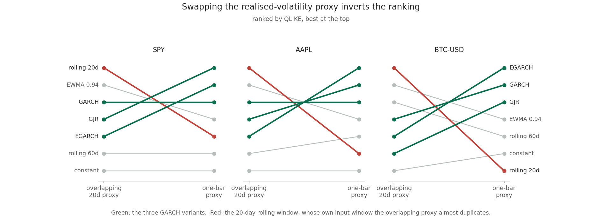
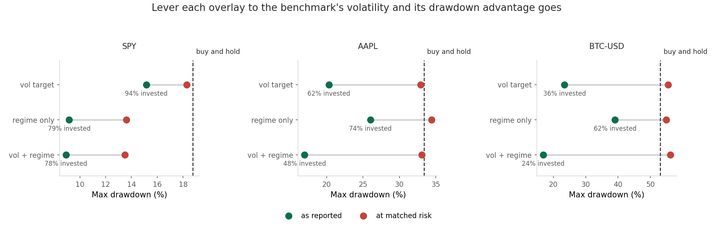
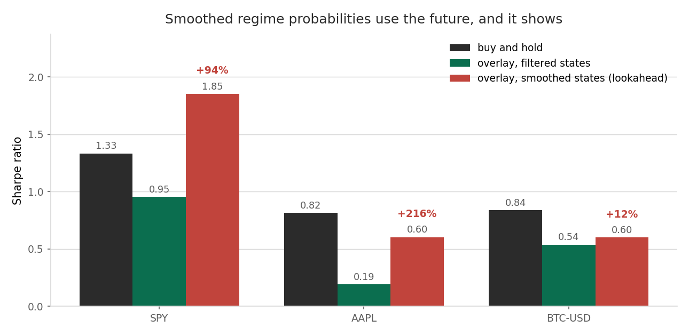

# Volatility Forecasting and Regime-Aware Trading Backtester

GARCH-family volatility forecasting, a two-state Markov regime model, and a
walk-forward backtest of the trading strategy those two signals imply, on SPY,
AAPL and BTC-USD.

The honest summary is split. **The forecasting half works:** the GARCH family
beats every simple baseline on all three assets, and the asymmetric variants
beat the symmetric one on the two equities, which is the leverage effect turning
up where theory says it should. **The trading half does not:** the volatility and
regime overlay loses to buy-and-hold on every asset, and once each book is
levered to the benchmark's volatility its drawdown advantage disappears.

This README is organised around those two results and around a correction,
because an earlier version of this project reported the opposite.

---

## Correction: what the previous version reported, and why it was wrong

The previous README reported "Sharpe ratio: +15-20% improvement" and "Max
drawdown: Reduced 8-12%" from the volatility overlay, and "out-of-sample RMSE"
comparisons between GARCH variants. None of those numbers could have been
produced by the code that was in the repository. Four defects, each now fixed
and each with a regression test named after it.

**1. The engine reported outperformance for a strategy identical to the
benchmark.** `BacktestEngine.run_backtest` returned `self.initial_capital *
cum_returns`, and `initial_capital` never changed, so every walk-forward window
restarted the portfolio at 100,000. The driver then concatenated those
window-local curves and took `pct_change()` across the joins, which inserted a
fabricated jump at every boundary and truncated drawdowns.

Run with a constant volatility forecast and an always-calm regime, so the
position is provably 1.0 every day, the old engine returned Sharpe -0.03 and a
-18.9% drawdown against -0.29 and -33.0% for simply holding the asset. Those
must be the same number. `test_constant_full_exposure_equals_buy_and_hold_exactly`
now asserts they are, to twelve decimal places.

**2. The out-of-sample volatility comparison scored an empty array.** Models were
fit on `train_returns`, so `garch_result['conditional_vol']` had length
`n_train`. The evaluation then read `conditional_vol.iloc[n_train:]`, which on an
800-element series returns nothing. Every GARCH and baseline comparison in the
old README ran on zero observations. `score_forecasts` now raises rather than
scoring an empty overlap, and forecasters are asked for one-step-ahead numbers
rather than for a series to slice.

**3. The regime signal used the future.** The backtest was fed
`smoothed_probs`, produced by the forward-backward pass, so the state
probability at bar t incorporated every observation after t. The README
simultaneously claimed "no lookahead bias". This version computes filtered
probabilities, refit on a growing window, and keeps the smoothed version only to
measure what the mistake was worth. See the section below: on AAPL it was worth
216% of the Sharpe.

**4. The walk-forward loop refit nothing.** Its docstring said "rolling model
refit"; inside, it sliced a whole-sample fit into windows. Models are now
re-estimated inside the loop, and `test_changing_a_future_return_cannot_change_an_earlier_forecast`
perturbs a return 300 bars ahead and asserts no earlier forecast moves.

Smaller corrections: log returns were compounded as if simple, the annualised
return raised `1 + mean(log return)` to the 252nd power, Sharpe had no
risk-free-rate argument, position weights were applied unlagged, there were no
transaction costs, and a degenerate return series produced a Sharpe of 7.3e16
because numpy's standard deviation of 100 identical values is 2.2e-19 rather
than zero.

## Finding 1: the realised-volatility proxy decides which model wins



A one-step-ahead variance forecast has to be scored against something, and the
choice is not innocent. The obvious candidate, a backward-looking 20-day
realised volatility, covers bars t-19 through t. A 20-day rolling forecast for
bar t is the standard deviation of bars t-20 through t-1. Those windows share
nineteen of twenty observations, so scoring one against the other measures
overlap rather than skill. Under that proxy the rolling window's correlation
with the target is 0.983 on SPY, 0.978 on AAPL and 0.974 on BTC, and it ranks
first on all three.

Score the same forecasts against bar t's own squared return, which shares
nothing with any forecaster's conditioning set, and the rolling window's
correlation falls to 0.229, 0.186 and 0.139, and it drops to fifth, sixth and
last. The GARCH family, which sat third to sixth under the overlapping proxy,
takes the top three places on every asset.

**QLIKE against the one-bar proxy, lower is better:**

| | SPY | AAPL | BTC-USD |
|---|---|---|---|
| GJR-GARCH | **-3.0512** | -1.7711 | -0.9189 |
| EGARCH | -3.0450 | **-1.7763** | **-0.9262** |
| GARCH | -2.9829 | -1.7470 | -0.9217 |
| EWMA 0.94 | -2.9246 | -1.7094 | -0.8904 |
| rolling 60d | -2.8305 | -1.6607 | -0.8559 |
| rolling 20d | -2.8444 | -1.6234 | -0.7816 |
| constant | -2.6887 | -1.6135 | -0.8296 |

Row order follows AAPL and BTC. SPY is the one asset where the two rolling
windows swap, with 20-day at -2.8444 just ahead of 60-day at -2.8305, and where
the expanding constant is last rather than sixth.

The ranking holds under a third target, realised volatility over the following
21 bars, which also shares nothing with the forecast's inputs. All three targets
are computed and stored, so the report shows the disagreement rather than
picking the flattering one.

An asymmetric variant wins on each equity, GJR on SPY and EGARCH on AAPL, and
both beat symmetric GARCH. On BTC the ordering is EGARCH, GARCH, GJR, with the
three within 0.008 QLIKE of each other, so the leverage effect that separates
them on equities is not visible in crypto. The old README asserted both of those
things without testing them. They turn out to be right.

## Finding 2: the overlay loses to buy-and-hold on every asset

Out of sample, after costs of 5bp per unit of turnover, positions lagged one
bar, volatility sized by the best forecaster for that asset:

| Sharpe | SPY | AAPL | BTC-USD |
|---|---|---|---|
| **Buy and hold** | **+1.332** | **+0.816** | **+0.838** |
| Volatility target | +1.280 | +0.607 | +0.795 |
| Regime only | +0.996 | +0.296 | +0.575 |
| Volatility and regime | +0.953 | +0.191 | +0.538 |

Every overlay is worse than doing nothing. The gap ranges from 4% on SPY's
volatility-target book to 77% on AAPL's combined book.

One detail links the two halves of the project. BTC's volatility-target book is
sized by the EGARCH forecast, the winner under the honest proxy, and it reaches
a Sharpe of 0.795 against a benchmark of 0.838. Re-run with `--no-garch`, so the
sizing falls back to the best baseline, and it is materially worse. A better
volatility forecast does make the strategy better. It does not make it good.

## Finding 3: the drawdown improvement is mostly just being less invested



Position size is capped at full investment and floored at zero, so the overlay
can only ever de-risk. It spends most of its life under-invested: 78% on SPY,
48% on AAPL, 24% on BTC for the combined book. A smaller book has a shallower
drawdown for free, which is not a result.

Scaling each strategy's returns by a constant until its realised volatility
matches the benchmark's removes that free lunch. It cannot change the Sharpe,
since Sharpe is scale-invariant, which is the point: this is a drawdown
comparison, not a return comparison.

| Max drawdown | SPY | AAPL | BTC-USD |
|---|---|---|---|
| Buy and hold | -18.8% | -33.4% | -53.1% |
| Volatility and regime, as reported | -8.9% | -17.0% | -16.9% |
| Volatility and regime, at matched risk | -13.5% | -33.0% | **-56.1%** |

On BTC the overlay appears to cut max drawdown from 53% to 17%, which is the
number that sells a strategy. At matched risk it is 56%, worse than holding. The
entire improvement was position size, and then some. On AAPL the matched
drawdown lands within half a point of the benchmark. Only SPY retains a genuine
five-point advantage.

## Finding 4: what the lookahead was worth



The repository deliberately keeps one strategy built the wrong way, on smoothed
regime probabilities, labelled `vol_and_regime_LOOKAHEAD`. It is not a result.
It exists so the cost of the original defect is measured rather than described.

| | SPY | AAPL | BTC-USD |
|---|---|---|---|
| Filtered states, honest | +0.953 | +0.191 | +0.538 |
| Smoothed states, lookahead | +1.852 | +0.603 | +0.600 |
| Inflation | **+94%** | **+216%** | +12% |

On SPY the lookahead takes a strategy that loses to buy-and-hold and turns it
into one that beats it by 39%. On AAPL it more than triples the Sharpe. The old
README's "+15-20% improvement" sits comfortably inside the range this effect
alone can manufacture, though it was also computed on the corrupted equity
curve, so the two causes cannot be separated after the fact.

## The regime model describes an index better than a stock or a coin

| | SPY | AAPL | BTC-USD |
|---|---|---|---|
| P(stay calm) | 0.991 | 0.930 | 0.793 |
| Expected calm duration, bars | 106.0 | 14.4 | 4.8 |
| Expected turbulent duration, bars | 52.9 | 4.3 | 2.8 |
| Volatility ratio between states | 2.17 | 2.45 | 2.86 |

The old README claimed regimes persist "30-60 days". That is roughly right for
SPY, whose turbulent state lasts about 53 bars, and wrong for the other two. A
BTC regime that flips every three to five days is not a macro regime; a
two-state Gaussian mixture on daily returns with excess kurtosis of 4.0 is
partly fitting fat tails rather than persistent states, and the same is true of
AAPL at 6.7. Read the SPY states as regimes and the other two as a volatility
filter with a probabilistic dial.

That distinction also explains the exposure column above. SPY's filtered
probability is stable, so the book stays near fully invested; BTC's jitters, so
the book averages a quarter invested and trades constantly.

## Turnover makes the regime signal close to untradeable

Exposure is a continuous probability, so it moves every day even when the state
does not.

| Annual turnover | SPY | AAPL | BTC-USD |
|---|---|---|---|
| Buy and hold | 0.3 | 0.3 | 0.2 |
| Regime only | 11.1 | 20.8 | **53.4** |
| Volatility and regime | 11.5 | 15.8 | 21.1 |

At 5bp, BTC's regime-only book pays 2.67% a year in costs. The old README
reported "Turnover: ~30-40% quarterly", which is off by two orders of magnitude
and was not measured by anything in the code. Any serious version of this
strategy needs a rebalance band or a hysteresis rule, and this one has neither.

## What I would not claim

- **No claim that the overlay would work with different parameters.** One
  volatility target, one cost assumption, one leverage cap, three assets, one
  five-year window. A search over those choices would find a combination that
  beats the benchmark, and finding it that way would mean nothing.
- **No claim about the future.** This is 2021 to 2026, a period containing one
  bear market and one long rally. Volatility targeting historically earns its
  keep across longer samples containing more crises than this one.
- **The leverage cap of 1.0 is a real limitation, not a neutral choice.** A
  volatility-target strategy that cannot lever up is not really targeting
  volatility, it is capping it. `--max-leverage` exists; the headline runs leave
  it at 1.0 so the comparison matches the original project's design.
- **The GARCH ranking is a QLIKE ranking, not a significance test.** The three
  variants sit close together: 0.068 QLIKE apart on SPY, 0.029 on AAPL and
  0.007 on BTC. Separating them properly needs a Diebold-Mariano test on the
  loss differentials, which this repository does not do. The gap between the GARCH family and the baselines is
  much larger and is where the confidence belongs.
- **The realised proxies are all imperfect.** A single squared return is a
  one-observation variance estimate. Intraday realised variance would be a far
  better target and is not available here.
- **No live trading, no slippage model, no borrow costs, no taxes.** Costs are a
  flat 5bp per unit of turnover, which is optimistic for BTC and pessimistic for
  SPY.

## How it works

**The engine cannot reset capital.** Walk-forward segments are concatenated as
returns and the equity curve is computed once, at the end. A test splits a
series into three segments, rejoins them, and asserts the drawdown is identical
to the unsplit version.

**Positions are lagged explicitly.** `run(..., lag=1)` shifts the weight before
it multiplies a return. A test builds a perfect-foresight signal and asserts it
earns a Sharpe above 8 unlagged and below 2 lagged, so any future change that
lets a signal see its own bar fails loudly.

**Filtered and smoothed states are separate functions.** `regime.py` implements
the two-state Gaussian HMM in numpy rather than delegating to a library whose
default output is the wrong one for trading. Tests assert that a later
observation cannot move a filtered probability and does move a smoothed one, and
that smoothing identifies the true state more accurately, which is exactly why
it is unusable as a signal.

**The GARCH recursions are implemented and tested here.** Only parameter
estimation uses `arch`. `garch_filter` and `egarch_filter` turn those parameters
into one-step-ahead forecasts, and a test simulates a GARCH path and recovers
its conditional variance to a relative tolerance of 1e-10. The step that can
silently corrupt a backtest does not depend on an untested library path.

**63 tests, no network or data required.** Each of the four defects above has a
test named after it.

## Running it

```bash
pip install -r requirements.txt

python -m unittest discover -s tests        # 63 tests
python scripts/backtest.py --symbol SPY     # writes reports/SPY/
python scripts/backtest.py --symbol AAPL
python scripts/backtest.py --symbol BTC-USD
python scripts/figures.py                   # writes reports/figures/
python scripts/verify_readme.py             # re-derives every figure above
```

```
src/volbt/
  data.py      price loading from a committed cache, simple returns
  vol.py       forecasters, the three scoring targets, QLIKE
  regime.py    two-state Gaussian HMM, filtered and smoothed states
  backtest.py  the engine: lagged positions, costs, exposure matching
  metrics.py   Sharpe, Sortino, drawdown, Calmar, with one return convention
scripts/
  backtest.py       the study; writes reports/<SYMBOL>/metrics.json
  figures.py        the three figures above
  verify_readme.py  checks every number in this README against reports/
tests/         63 tests, one per defect plus the properties above
data/          daily closes, cached so the numbers stay reproducible
```

## Data

Daily adjusted closes for SPY, AAPL and BTC-USD from Yahoo Finance via
`yfinance`, 2021-08-31 to 2026-08-30. The CSVs are cached in `data/` and
committed, because yfinance history is revised over time and a backtest whose
numbers cannot be reproduced is not a backtest.

Out-of-sample spans: 750 bars for SPY and AAPL, 1,321 for BTC-USD, after a
504-bar initial training window. Volatility parameters are re-estimated every 21
bars and regime parameters every 63.

## License

MIT
